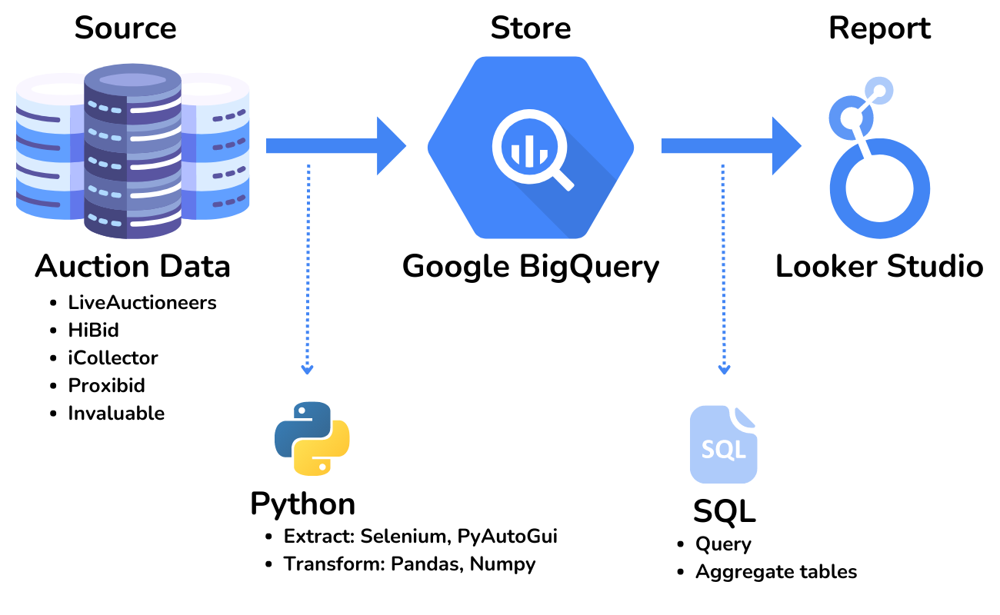

<h1 align="center">Creating an Auction House Database and ETL Pipelines for Data Analysis</h1>

<strong>Data Engineering Capstone or the University of Montana. </strong>

<h2>About</h2>
This is a data engineering project for Davis Brothers, an auction company based in Missoula, Montana. After each auction, this company manually exports reports across five different auction platforms. This task entails clicking and exporting from the platforms software, and copying and pasting text off of a webpage. When the information is copied and pasted from a website, it is because the platform does not included that important information in their reports. 

<h2>Goal</h2>
To create a script that exports and uses text mining to pull all information into a report and create a database where this information can be accessed. In addition, a dashboard showing an overview of customer data by platform for each auction is needed. 

<h2>Features</h2>
- Selenium Python package used to automate reporting. This drives a web broswer and uses functions based on HTML/CSS. 
- PyAutoGUI Python package used to automate reporting for desktop application. This package is based on screen coordinates. 
- Google Big Query, Python idiomatic client for Google Cloud Platform services

<h2>Key learnings</h2>

- Using Selenium in Python can automate manual reporting tasks by clicking, input and extracting
- BeautifulSoup is a powerful web-scraping package for text mining 
- PyAutoGUI can automate desktop applications but has limitations 

